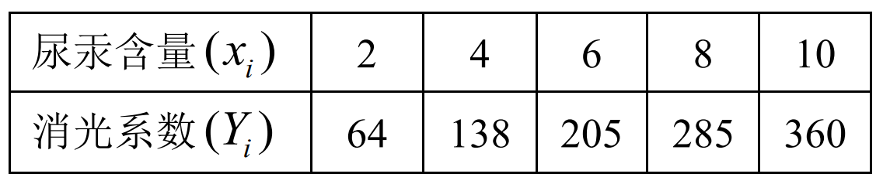

某医院用光电比色计检验尿永时, 测得尿永含量 $(\mathrm{mg} / \mathrm{l})$ 与消光系数读数的结果如下:

已知 $Y_{i}$ 与 $x_{i}$ 之间服从线性模型 $Y_{i}=a+b x_{i}+\varepsilon_{i}, \varepsilon_{i} \sim N\left(0, \sigma^{2}\right), i=1,2, \cdots, 5$.
(1) 试求系数 $a, b$ 的估计值, 并写出线性回归直线方程;
(2) 求 $\sigma^{2}$ 的无偏估计值;
(3) 检验 $Y$ 与 $x$ 之间是否存在显著的线性相关关系(取 $\alpha=0.05$ );
(4) 在 $x=12$ 时, 做出 $Y$ 的预测区间 (取置信概率为 0.95 )。
参考数据:
$$
\begin{array}{l}
F_{0.025}(1,3)=17.44, F_{0.05}(1,3)=10.13, F_{0.05}(1,5)=6.61, \\
t_{0.025}(4)=2.776, t_{0.025}(5)=2.5706, t_{0.025}(3)=3.182
\end{array}
$$

